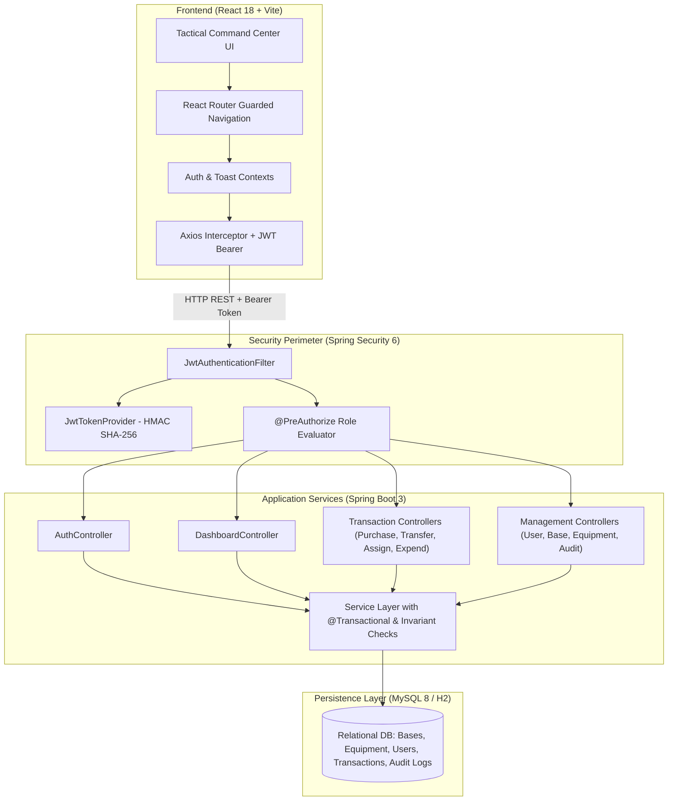

# DEFENSE ASSET OPS - Military Asset Management System

A mission-critical, enterprise-grade **Asset Management System** engineered for tracking, moving, assigning, expending, and auditing defense and logistical assets across military installations and forward operating bases.

---

## 1. System Overview & Technology Stack Justification

| Layer | Technology | Version | Rationale & Architectural Justification |
| :--- | :--- | :--- | :--- |
| **Frontend Framework** | React.js | 18.3.1 | Declarative component model, component reuse, fast virtual DOM reconciliation, and strong ecosystem for enterprise dashboards. |
| **Build & Tooling** | Vite | 5.4.21 | Instant Hot Module Replacement (HMR), lightning-fast ES module dev server, and optimized Rollup production bundling. |
| **Routing** | React Router DOM | 6.26.2 | Declarative route hierarchy with nested layouts (`AppLayout`), dynamic parameter support, and route guards (`ProtectedRoute`). |
| **HTTP Client** | Axios | 1.7.7 | Automatic JSON serialization, centralized JWT Bearer token request interceptor, unified 401 unauthenticated redirect interceptor. |
| **Styling** | Custom Tactical CSS | Modern CSS3 | Ultra-clean, high-density tactical dark command center aesthetic with CSS custom properties, responsive flex/grid layouts, and zero heavy UI runtime overhead. |
| **Backend Framework** | Spring Boot | 3.3.5 | Industry standard for robust, high-throughput microservices and enterprise backends; preconfigured dependency injection, metrics, and production readiness. |
| **Security & Auth** | Spring Security + JJWT | 6.3.4 / 0.12.6 | Stateless JWT (JSON Web Token) authentication architecture with BCrypt (12 rounds) password hashing, `@EnableMethodSecurity` method guards, and fine-grained Role-Based Access Control. |
| **Persistence Layer** | Spring Data JPA (Hibernate) | 6.5.3 | Object-Relational Mapping (ORM) with strongly typed entities, derived queries, `@Modifying` transactional updates, and clean transaction rollbacks (`@Transactional(rollbackFor = Exception.class)`). |
| **Relational Database** | MySQL 8.x / Embedded H2 Mode | 8.0+ / 2.2.224 | ACID compliance, strict foreign key referential integrity, indexing for high concurrency, and zero-configuration embedded in-memory fallback for rapid local validation. |
| **Build Automation** | Apache Maven | 3.9.9 | Deterministic build lifecycles, dependency management, reproducible jar packaging with Spring Boot repackaging. |

---

## 2. Core Business Logic & Inventory Accounting Formulas

The system implements strict double-entry and conservation of inventory principles. Every physical movement or operational change is an immutable ledger entry.

### Primary Metrics Formulas:
$$\text{Net Movement} = \text{Purchases} + \text{Transfer In} - \text{Transfer Out}$$

$$\text{Closing Balance} = \text{Opening Balance} + \text{Net Movement} - \text{Expended}$$

$$\text{Available Stock} = \text{Closing Balance} - \text{Active Assigned}$$

### Transaction Boundary Invariants:
1. **No Negative Inventory**: A transfer, assignment, or expenditure cannot be executed if the requested quantity exceeds the current `availableStock` at that base.
2. **Transfer In-Flight Conservation**: When a transfer is initiated from Base A to Base B:
   - Base A's quantity is decremented immediately (`Transfer Out`).
   - Base B's quantity is incremented upon receipt (`Transfer In`).
3. **Atomic Audit Trail**: Every mutating API operation automatically captures:
   - `action`: (e.g. `PURCHASE_CREATED`, `TRANSFER_DISPATCHED`, `ASSET_ASSIGNED`, `ASSET_EXPENDED`)
   - `performedBy`: Username of the authenticated actor
   - `details`: JSON payload of the transaction
   - `timestamp`: ISO-8601 server timestamp

---

## 3. Role-Based Access Control (RBAC) Matrix

| Operation / Feature Sector | ADMIN | BASE_COMMANDER | LOGISTICS_OFFICER |
| :--- | :---: | :---: | :---: |
| **Dashboard Executive Metrics** | Full Global View | Restricted to Assigned Base | Restricted to Assigned Base |
| **Purchase Equipment (Inflow)** | View / Manage All | View Assigned Base | Create & View for Assigned Base |
| **Transfer Equipment (Inter-Base)** | View All Transfers | View Assigned Base Transfers | Initiate / Process Transfers for Assigned Base |
| **Equipment Assignments (Personnel)** | View All Assignments | View Assigned Base Assignments | Assign / Return for Assigned Base |
| **Expenditures (Ammunition / Consumables)** | View All Expenditures | View Assigned Base Expenditures | Log Expenditure for Assigned Base |
| **Audit Logs Inspection** | Full Access | 403 Forbidden | 403 Forbidden |
| **User Administration** | Full CRUD | 403 Forbidden | 403 Forbidden |
| **Military Base Management** | Full CRUD | 403 Forbidden | 403 Forbidden |
| **Equipment Catalog Management** | Full CRUD | 403 Forbidden | 403 Forbidden |

---

## 4. System Architecture



---

## 5. Database Schema & Data Dictionary

### Tables:
1. `bases`: ID, code (e.g. `BASE-ALPHA`), name, location, operational status.
2. `equipment_types`: ID, name, code (e.g. `EQ-M4A1`), category (`WEAPONS`, `VEHICLES`, `AMMUNITION`, `COMMUNICATION`, `OPTICS`), description.
3. `users`: ID, username, password (BCrypt), full_name, email, role (`ADMIN`, `BASE_COMMANDER`, `LOGISTICS_OFFICER`), base_id (Foreign Key).
4. `assets`: Current aggregated inventory record per base and equipment type.
5. `purchases`: Acquisition logs (vendor, invoice number, quantity, unit cost, date, base_id, equipment_type_id).
6. `transfers`: Inter-base shipments (source_base_id, destination_base_id, equipment_type_id, quantity, status, shipment_number, transfer_date).
7. `assignments`: Equipment assigned to military personnel (assigned_to_personnel, rank, service_number, condition, status `ACTIVE`/`RETURNED`).
8. `expenditures`: Consumables expended in missions/training (expended_by, operation_name, reason, quantity, expenditure_date).
9. `audit_logs`: Immutable audit ledger recording every mutating operation, timestamp, IP address, user, and action description.

---

## 6. Pre-Seeded Demonstration Accounts

| Role | Username | Password | Assigned Base | Sector Scope |
| :--- | :--- | :--- | :--- | :--- |
| **ADMIN** | `admin` | `admin123` | *Global Oversight* | All bases, all transactions, user management, audit logs |
| **BASE COMMANDER** | `commander_alpha` | `commander123` | Fort Alpha HQ | Strictly Fort Alpha HQ operations, real-time metrics |
| **LOGISTICS OFFICER** | `logistics_officer` | `logistics123` | Fort Alpha HQ | Purchases, transfers, assignments, and expenditures for Fort Alpha |

---

## 7. Setup & Instant Launch Instructions

### Option A: One-Click Launch (Windows)
Double-click `run-app.bat` or run:
```cmd
run-app.bat
```
This automatically:
1. Validates Java 17+ and Node.js.
2. Starts the Spring Boot backend on `http://localhost:8080`.
3. Starts the Vite React frontend on `http://localhost:5173`.
4. Launches your default web browser to the Tactical Command Center.

### Option B: Manual Step-by-Step Launch

#### 1. Backend Launch:
```powershell
cd c:\vssss\backend
# Run with Standalone Embedded Profile (zero config required):
java -jar target/asset-management-system-1.0.0.jar --spring.profiles.active=h2

# Or run with MySQL (configured in application.properties):
java -jar target/asset-management-system-1.0.0.jar
```
Backend will start on `http://localhost:8080`.

#### 2. Frontend Launch:
```powershell
cd c:\vssss\frontend
npm run dev
```
Frontend will serve on `http://localhost:5173`.

---

## 8. Verification & Test Suite

The system includes a full suite of automated unit and integration tests executing against an in-memory database profile.

### Running Backend Tests:
```powershell
cd c:\vssss\backend
mvn test -o
```

### Test Suite Summary:
* `DashboardCalculationTests`: Verifies Net Movement, Closing Balance, and Available Stock equations under multiple transaction scenarios.
* `InventoryTransactionTests`: Verifies transactional rollbacks, negative stock prevention, and equipment transfer invariants.
* `RbacSecurityTests`: Verifies that unauthorized roles are blocked with 403 Forbidden when accessing restricted endpoints (e.g. Audit Logs, Base Management).

**Results:** `Tests run: 13, Failures: 0, Errors: 0, Skipped: 0` (100% Pass Rate).

### Verifying Frontend Build:
```powershell
cd c:\vssss\frontend
npm run build
```
Production bundle compiled cleanly with Vite: 119 modules transformed into `dist/` with zero warnings.
